## 本项目完整源码是收费的  接毕业设计和论文

### 作者微信：grapro666 QQ：3642795578 (支持部署调试、支持代做毕设)

### 接javaweb、python、小程序、H5、APP、各种管理系统、单片机、嵌入式等开发

### 选题+开题报告+任务书+程序定制+安装调试+论文+答辩ppt

**博客地址：
[https://blog.csdn.net/2303_76227485/article/details/141168077](https://blog.csdn.net/2303_76227485/article/details/141168077)**

**视频演示：
[https://www.bilibili.com/video/BV1ShYCe7EBX/](https://www.bilibili.com/video/BV1ShYCe7EBX/)**

**毕业设计所有选题地址：
[https://github.com/ynwynw/allProject](https://github.com/ynwynw/allProject)**

## 基于Java+ssm的仓库管理系统(源代码+数据库)635

## 一、系统介绍
分为员工、管理员两种角色
### 1、员工：
- 登录、库存管理、出入库管理、密码修改

### 2、管理员：
- 库存管理、出入库管理、导入导出、人员管理、供应商管理、客户管理、货物管理、仓库管理、日志管理

## 二、所用技术

后端技术栈：

- SSM
- SpringMvc
- Mybatis
- Mysql
- Maven

前端技术栈：
 
- Jsp
- bootstrap
- ajax
- jquery
- css

## 三、环境介绍

基础环境 :IDEA/eclipse, JDK1.8, Mysql5.7, Maven3.6, navicat

所有项目以及源代码本人均调试运行无问题 可支持远程调试运行

## 四、页面截图
### 1、员工：
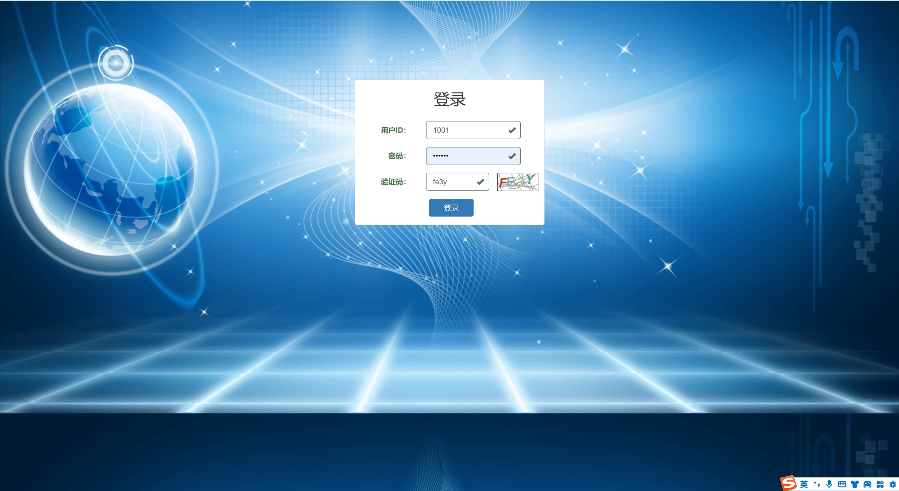
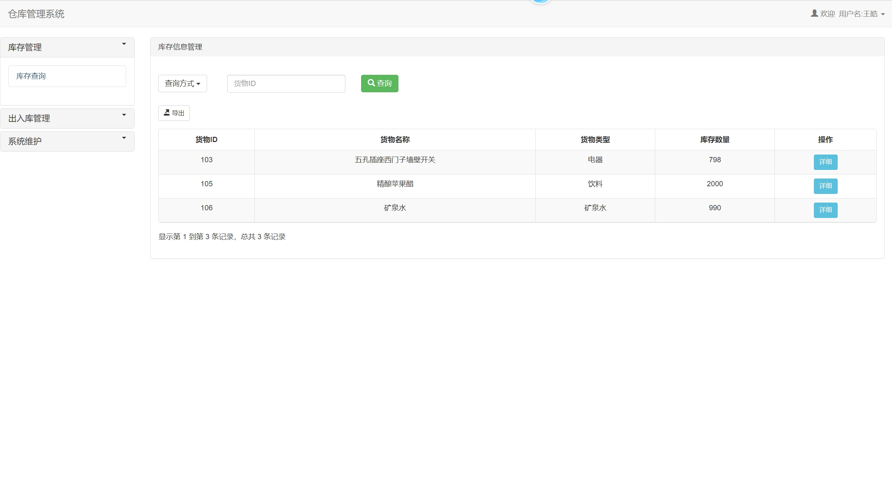
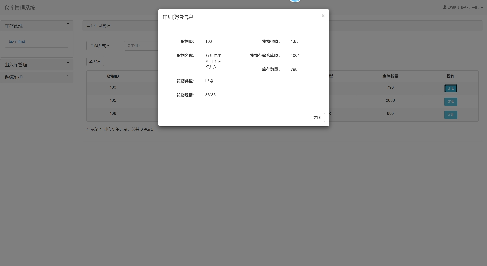
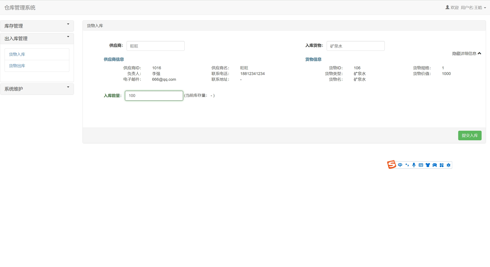
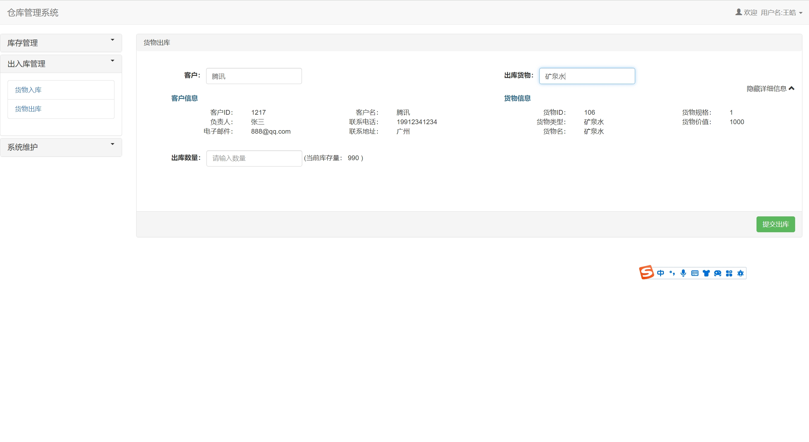
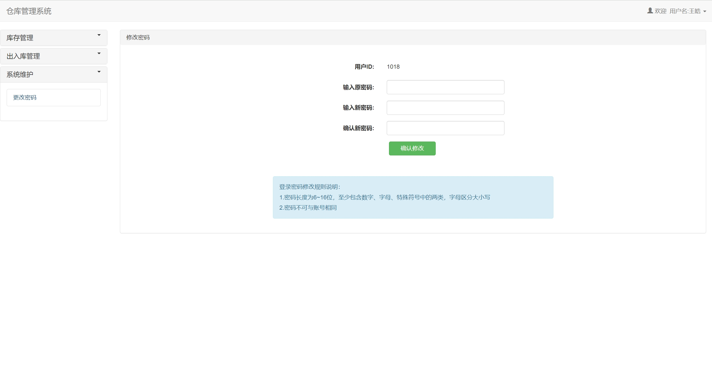

### 2、管理员：
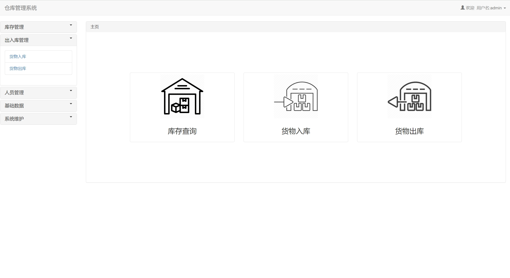
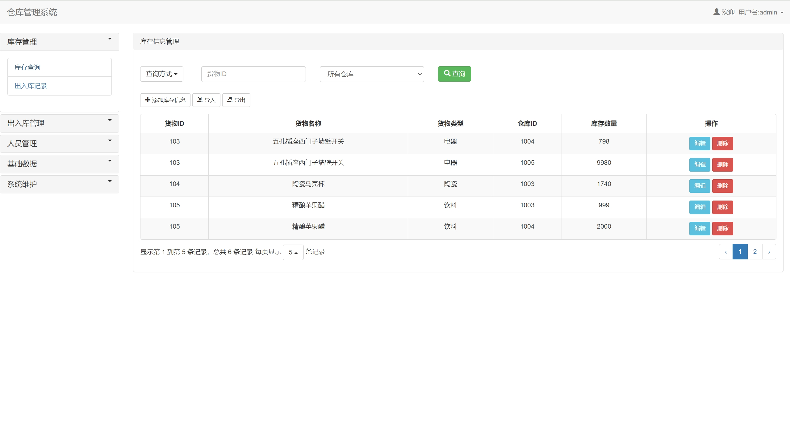
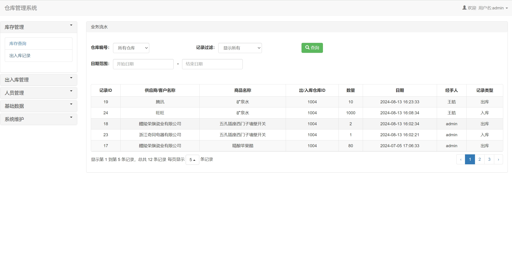
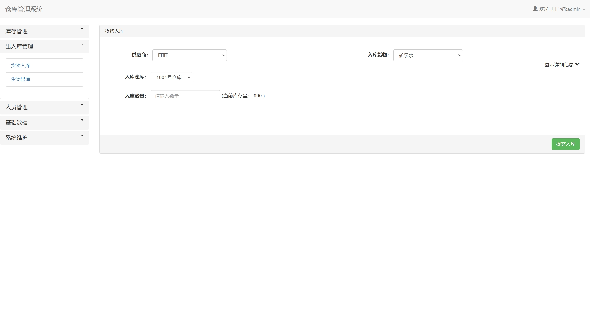
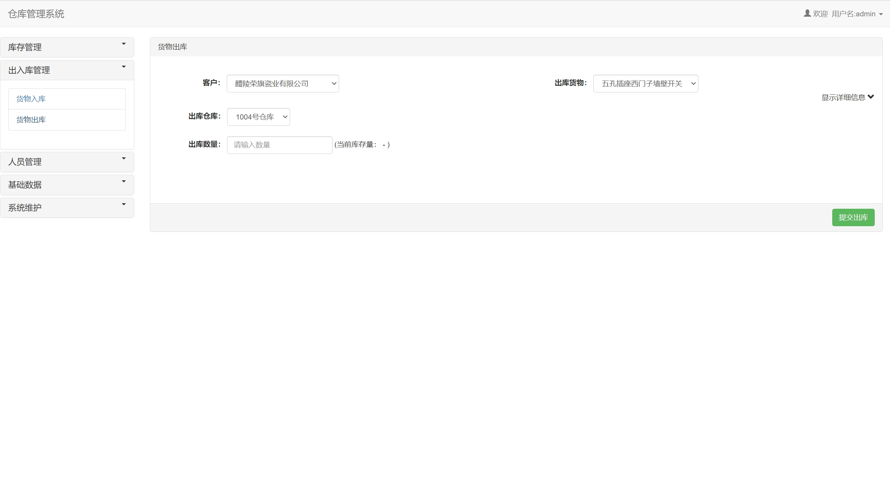
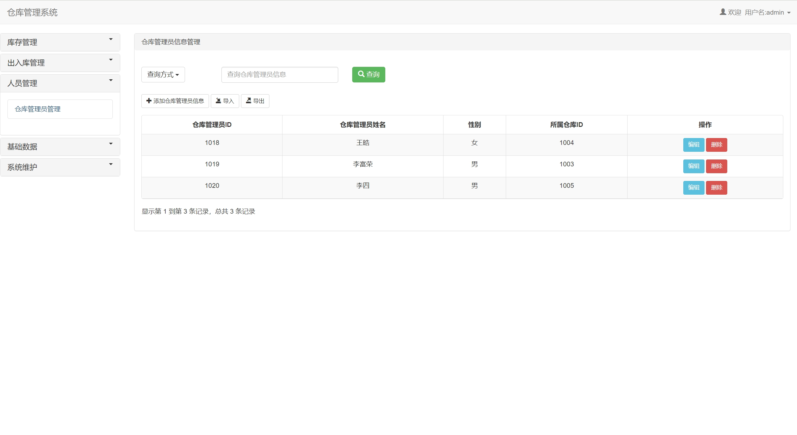
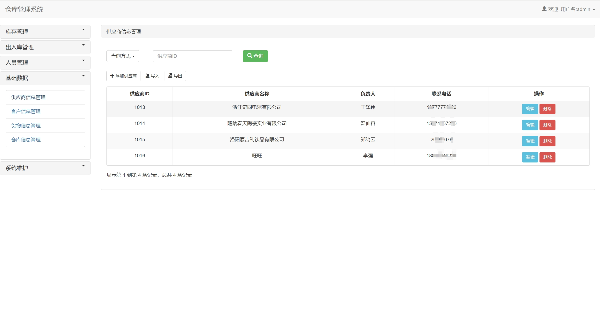
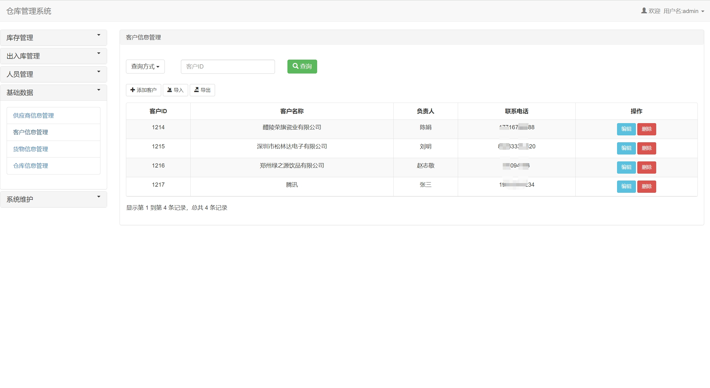
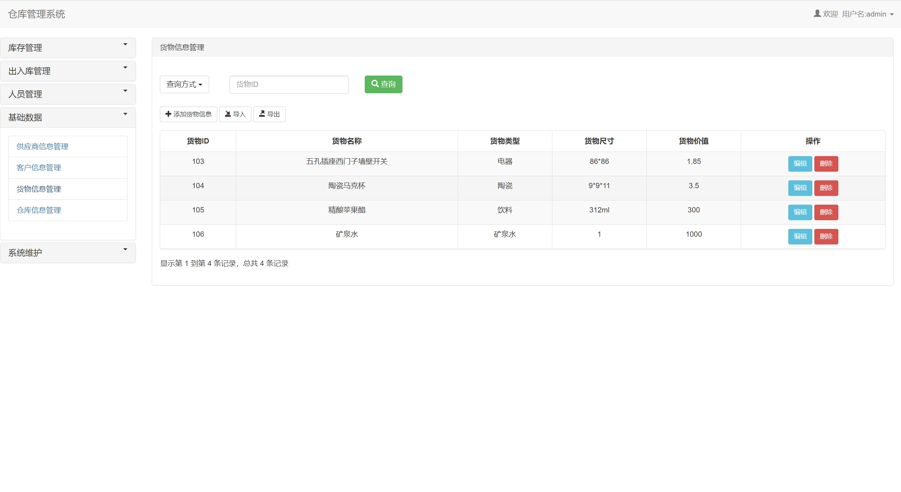
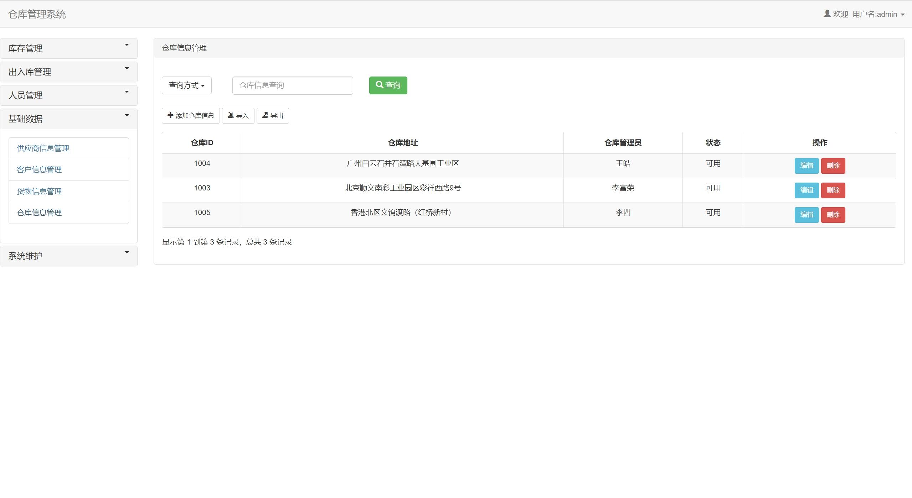
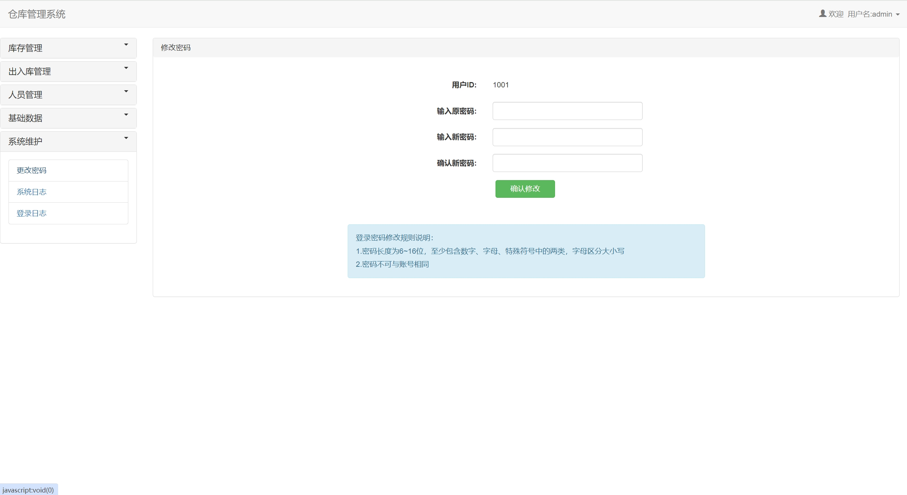
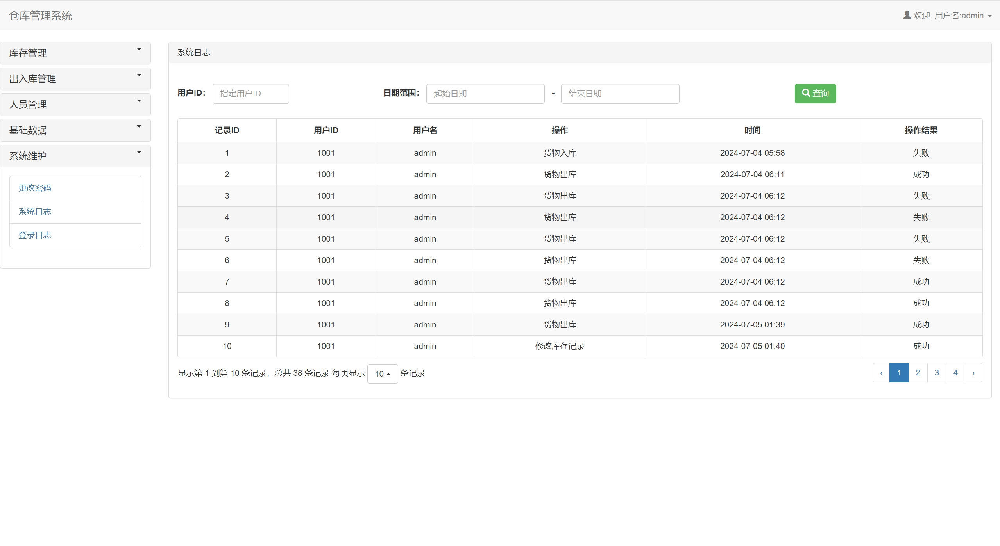
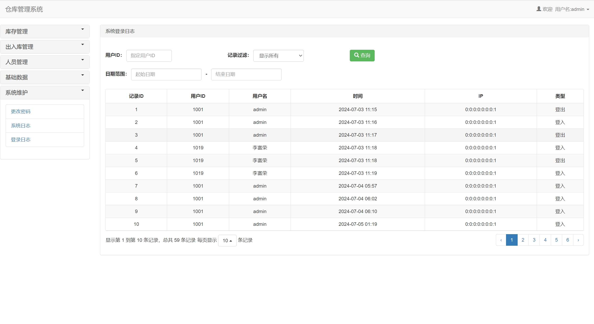

## 五、浏览地址

后台地址：http://localhost:8080/WMS/login

员工账号密码：1018/123456

管理员账户密码：1001/123456

## 六、部署教程
1. 使用Navicat或者其它工具，在mysql中创建对应名称的数据库，并执行项目的sql文件

2. 使用IDEA/Eclipse导入warehouseManage项目，若为maven项目请选择maven，等待依赖下载完成

3. 修改src/main/resources/config/DBConfig.properties里面的数据库配置 

4. 配置tomcat将项目war包加到tomcat容器里面，启动tomcat
